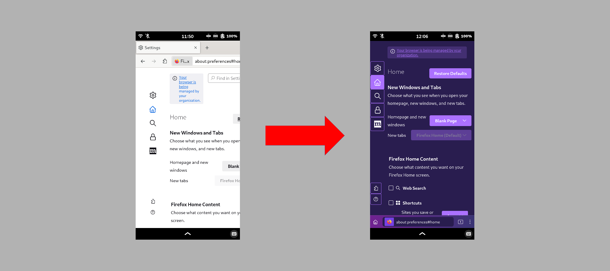

# Mobile-Friendly-Firefox (FriendlyFox)

Custom CSS styles for Firefox browsers on Linux, with a focus on mobile devices like Librem 5 and PinePhone.

Much of the code is conditional so as to support features that dynamically change based on window size.

Some of the code in this repo comes from [postmarketOS mobile-config-firefox gitlab project](https://gitlab.com/postmarketOS/mobile-config-firefox/) and [MrOtherGuy's Firefox CSS Hacks on github](https://github.com/MrOtherGuy/firefox-csshacks/) ([and reddit](https://teddit.net/u/It_Was_The_Other_Guy)).




## Compatibility:

#### Device Support:

* Computers running a Linux distribution as the operating system (including phones, laptops, and desktops)

While not explicitly supported, non-linux devices may be compatible to some extent.

#### Browser Support:

* Firefox Browser
* Librewolf Browser
* Mullvad Browser
* Tor Browser


## Dependencies:

* `bash` (default login shell for most Linux distributions and available on nearly all modern operating systems)

postmarketOS:

```
sudo apk add bash
```


## Note:

It is recommended to uninstall the `mobile-config-firefox` package so that it does not overwrite your customizations.

postmarketOS:

```
sudo apk del mobile-config-firefox
```


## Download:

#### Option 1:

* Clone this repo:

```
git clone https://github.com/justuser-31/Mobile-Friendly-Firefox.git
```

## Pre-Install:

#### Option 1:

* Navigate to `about:config` in the URL Bar

* Copy and paste the following text into the Search Bar on the page:

```
toolkit.legacyUserProfileCustomizations.stylesheets
```

* Double-click the preference to toggle it from false to true or click the toggle button on the right

#### Option 2:

* Add the following text to a file named 'user.js':

```
user_pref("toolkit.legacyUserProfileCustomizations.stylesheets", true);
```

* Copy the file into your Firefox profile folder, located here:

```
~/.mozilla/firefox/PROFILE.default-esr/
```


#### Option 3:

* When using the automated install, select "Add Recommended Preferences" to add the following to a `user.js` file in each browser profile:

```
/** Begin Mobile-Friendly-Firefox Customizations **/
user_pref("toolkit.legacyUserProfileCustomizations.stylesheets", true); // [FF68+] allow userChrome/userContent
user_pref("browser.tabs.warnOnClose", true); // Confirm before closing multiple tabs
user_pref("browser.tabs.closeWindowWithLastTab", false); // disable closing window with last tap
user_pref("browser.tabs.allowTabDetach", false); // disable detachable tabs
user_pref("nglayout.enable_drag_images", false); // disable tab preview image on drag
user_pref("browser.uidensity", 2); // 0=default, 2=touch
/** End Mobile-Friendly-Firefox Customizations **/
```


## Automated Install:

#### Option 1:

* Secondary-click or tap & hold on the FriendlyFox desktop icon, then click/tap the Install option (use Option 2 to install FriendlyFox desktop icon)

#### Option 2:

* Run the following command:

```
sh Mobile-Friendly-Firefox/friendlyfox.sh install.sh
```


## Automated Update:

#### Option 1:

* Secondary-click or tap & hold on the FriendlyFox desktop icon, then click/tap the Update option

#### Option 2:

* Run the following command:

```
sh Mobile-Friendly-Firefox/friendlyfox.sh update.sh
```


## Automated Uninstall:

#### Option 1:

* Secondary-click or tap & hold on the FriendlyFox desktop icon, then click/tap the Uninstall option

#### Option 2:

* Run the following command:

```
sh Mobile-Friendly-Firefox/friendlyfox.sh uninstall.sh
```


## Manual Install:

These are the steps for users that do not want to use the automated install script:

1. [Download one of the userChrome styles](/user0/Mobile-Friendly-Firefox/src/branch/master/src/userChrome/styles/), or make your own variation.

2. [Download the files for the style(s) you chose](/user0/Mobile-Friendly-Firefox/src/branch/master/src/userChrome/).

3. [Download one of the userContent styles](/user0/Mobile-Friendly-Firefox/src/branch/master/src/userContent/styles/)

4. Place all CSS code in a folder named ***`chrome`***.

5. Place ***`chrome`*** folder in your Firefox profile:
**`~/.mozilla/firefox/PROFILE.default-esr/chrome/`**

6. Modify `userChrome.css` to enable and disable files to create the desired style.

* Remember to ***disable*** files that you don't want by ***commenting them out*** in the `userChrome.css` file.

  * For instance, if you don't want the toolbars to be moved to the bottom of the screen, then ***disable*** the following files by ***adding slashes and asterisks like this:***

```
/*
@import "browser.css";
*/
```

```
/*
@import "alt-browser-alt.css";
*/
```

  * Everything between **`/*`** and **`*/`** is a comment and will be disabled.

* Remember to ***enable*** files that you do want by ***uncommenting them*** in the `userChrome.css` file.

  * For instance, if you want to apply my `fenix_colors` style, then ***enable*** the following file by ***deleting the slashes and asterisks directly above and below it:***

```

@import "fenix_colors.css";

```

  * Make sure that for each **`/*`** that begins a comment, there is a **`*/`** that ends the comment.

**Note:** Unified Extensions Menu, Tab Manager Menu, and Main App Menu can be scrolled with a scrollbar on the right side of the menu popups, and Main App Menu has a New-Tab button in the menu popup, which makes the New-Tab button in the Tab Bar unnecessary.
